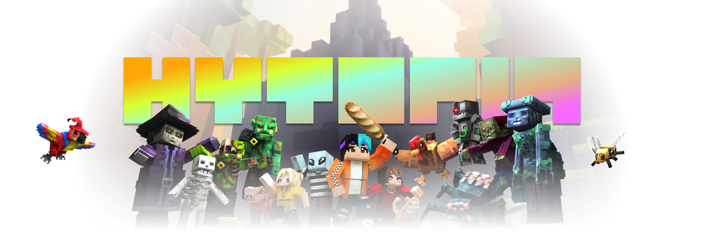

# HYTOPIA SDK

## Quick Links
[Quickstart](#quickstart) • [API Reference](./docs/server.md) • [Report Bugs or Request Features](https://github.com/hytopiagg/sdk/issues)

## What is HYTOPIA?


HYTOPIA is a modern games platform inspired by Minecraft, Roblox, and Rec Room.

HYTOPIA allows you to create your own highly-sharable, immersive, massively multiplayer games in a voxel-like style. All playable in a web browser on any device!

## What is this SDK?

*Note: This SDK is currently in alpha development. Expect breaking changes with new version releases.*

The HYTOPIA SDK makes it easy for developers to create multiplayer games on the HYTOPIA platform using JavaScript or TypeScript. 

Available as a simple NPM package, this SDK provides everything you need to get started:

- Compiled HYTOPIA Server: The ready-to-use server software.
- Game Client & Debugger: For rapidly testing and developing your games.
- TypeScript Definitions: For strong typing and code completion.
- Documentation: Detailed guides and references.
- Default Assets: Textures, models and audio you can use in your games.
- Game Examples: Sample projects & scripts showing how to build different types of games.

With these resources, you can quickly build and share immersive, voxel-style multiplayer games on HYTOPIA.

## Quickstart

1. Install a compatible JavaScript runtime. We recommend [Bun (recommended)](https://bun.sh/), but [Node.js](https://nodejs.org/) and [Deno](https://deno.com/) are also supported. All examples will be given using Bun.

2. If you're starting a new project, initialize it.
```bash
bun init
```

3. Install the SDK in a new or existing project.
```bash
bun add hytopia
```

4. Initialize boilerplate. Copies assets and an index.ts game script into your project.
```bash
bunx hytopia init
```

5. Start the server, use --watch for hot reloads as you make changes.
```bash
bun --watch index.ts
```

6. Visit https://play.hytopia.com - when prompted, enter `localhost:8080` - this is the hostname of the local server you started in the previous step.

Once you're up and running, here's some other resources to go further:
- [Game Examples](./examples)
- [API Reference](./docs/server.md)

## Architecture & Motivation

HYTOPIA gives developers full control to create any game imaginable in a voxel-like style. The underlying architecture handles low-level tasks like networking, prediction, entity lifecycle, physics and more, so you can focus on building and deploying games quickly.

With HYTOPIA's 100% server-authoritative setup and overall implementation, games are default-deterministic. All game inputs by players are relayed to and verified by the server, making gameplay naturally anti-cheat and preventing exploits like position spoofing.

HYTOPIA overcomes the creativity limits of Minecraft, the complexities of Unity and UE5, and the difficult developer learning curve of Roblox with a developer-first, flexible approach, enabling you to build games in hours using JavaScript or TypeScript.

Bring your own game assets as GLTF models with full server-driven animation support, block textures, ambient and sfx audio, and more - or use HYTOPIA's defaults included with this SDK to craft your game.

We built HYTOPIA to empower both veteran and aspiring game developers to create multiplayer-first, voxel-style, hyper-sharable games. Developer APIs and documentations are simple, powerful and clear. Whether you've been building games for years, a frontend web developer who's dreamed of building a game, an eager learner that's always dreamed of building games, or a curious school student, HYTOPIA was built for you..